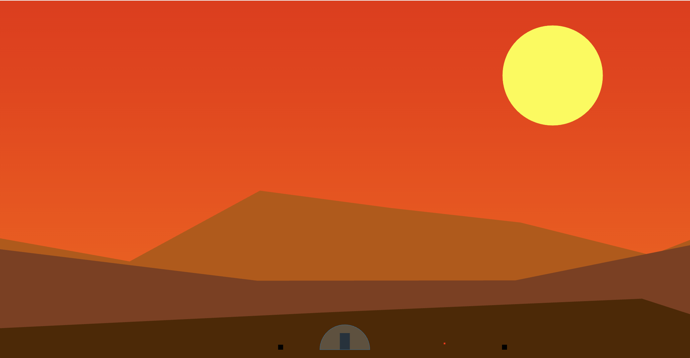

### Inspired by js13k games. Simple tower defense with zero dependencies (local/dev doesn't count).



### How to run:
```
npm ci
npm start
```

### WIP

### Current feature list:
- random background generation
- enemies
- bullets
- enemy x bullet colissions
- damage and HP for bullet and enemies

### TODO: user HP and upgrades for tower